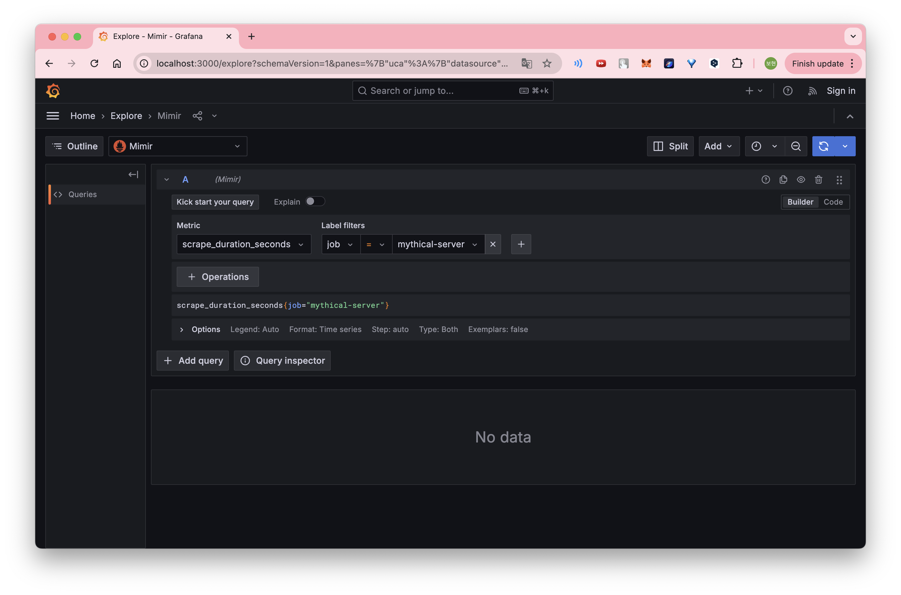

## 실습 내용
Grafana Labs에서 제공하는 intro-to-mltp 실습 환경을 활용해, 기존 Alloy 기반 메트릭 수집 구성을 수정하여 내가 수집하고 싶은 메트릭을 Alloy를 통해 수집하도록 변경할 예정이다.

### 하고싶은 것: 서버/클라이언트의 메트릭 수집에 초점
- Alloy 사용 유지, 기존 구성 파일(config.alloy)을 직접 수정
    - 그 이유는 실습 환경 전체가 Alloy 기반으로 구성되어 있기 때문에 사용하는 게 편할 거라고 판단 ,,  
        (intro-to-mltp는 로그, 트레이스, 메트릭, 프로파일링까지 Alloy가 중앙 허브 역할을 함)
- 기존 mythical-server, mythical-requester 서비스에서 노출되는 /metrics 데이터를 수집 (mythical-server와 mythical-requester 두 개 서비스에 대해서만 Prometheus 메트릭 수집)
    - mythical-server : 서버 메트릭 수집
    - mythical-requester : 클라이언트 메트릭 수집
- prometheus.scrape 블록을 직접 정의하여 원하는 스크랩 주기, 레이블(label), group, service, job 이름 등을 설정
    - 앱 내에서 이미 prom-client를 통해 메트릭을 생성 및 노출하고 있기 때문에 그 중에서 원하는 것만 수집하는 거로 이해  
    (Alloy의 config.alloy를 통해서 그 메트릭을 수집(scrape)해서 라벨을 붙이고 전송하는 역할)
    - group 설정 : mythical
    - service 설정 : 각각 mythical-server, mythical-reqeuster 
    - job 설정 : 각각 mythical-server, mythical-reqeuster 
    > 아래를 보면 설정한 것만 뜨는 것을 확인할 수 있음

- 수집한 메트릭을 Mimir에만 전송
- 수집 주기: 10초
- 로그나 트레이스 수집은 안함(loki, tempo 등)

### 클라이언트 메트릭은 왜 수집하나?
아래와 같은 상황에서 유용할 수 있음:
- 서버가 여러 개일 때 : 어떤 서버로 요청을 보냈는지 추적 가능
- 네트워크 레이턴시 측정 : 서버 응답 시간뿐 아니라 클라이언트 관점의 응답 시간 측정 가능
- 장애 감지	: 서버는 200 응답했지만 클라이언트가 타임아웃이 날 수도 있음
- 부하 시뮬레이션 : mythical-requester처럼 클라이언트가 테스트 트래픽을 발생시키는 경우, 그 자체의 상태도 중요

실습 맥락에서는 아래와 같은 부분들을 파악 가능:
- 클라이언트가 보내는 요청 수 (http_requests_total)
- 응답 지연 시간 (http_request_duration_seconds)
- 에러율
> 전체적으로 서버와의 통신이 잘 되고 있는가를 확인

## 참고
- alloy/config.alloy: 메트릭 수집 및 전송 구성 수정
- Grafana 접속: http://localhost:3000
- Prometheus-like 메트릭 확인: up, http_requests_total, 또는 직접 추가한 커스텀 메트릭